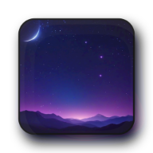

<h1 align='center'>
    
    <br/>
    blek! File
</h1>

blek! File is a free service that would help you with file sharing.

The principle is very simple: you upload a file, then download it from another device. The file will be deleted after 1 download or 30 minutes.

## Public instances
List of official instances

| Name | Administrator | URL |
| --- | --- | --- |
| 🌠 blek! File | b1ek &lt;me@blek.codes&gt; | [https://file.blek.codes](file.blek.codes) |

To add your instance in this list, fork and open a PR.

To qualify, your instance must be having:  
1. Uploads without a password turned on
2. Have proper ToS
3. Come up with a unique name
4. Have a public administrator email

## Contributing
Contributing guide is available [here](./CONTRIBUTING.md) (the CONTRIBUTING.md file).

## Licensing
This software is released under GPL3 license, a copyleft license that protects users' freedom by ensuring that all future copies of this software are open source as well.

## Deploying
Simply copy the `docker-compose.yml.example` to `docker-compose.yml`, and `.env.example` to `.env` and edit them if necessary.

The following could be done with these bash commands:
```bash
$ # Notice that those are just for reference; you may not want to 100% copy them
$ cp docker-compose.yml.example docker-compose.yml
$ cp .env.example .env
$ nvim .env # you need to edit this file
# docker-compose up -d # "#" at the start means that the command must be run as root/sudo
$ # It all should me up and running at this point
```

## Screenshots
